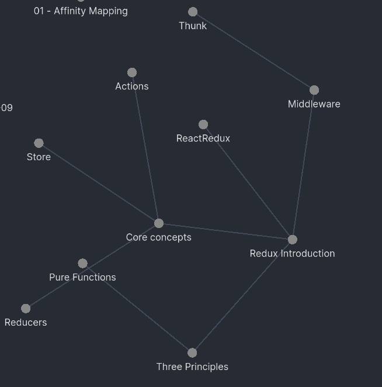

# Udacity React Nanodegree

This repo contains the projects submitted to the Udacity React [Nanodegree](https://www.udacity.com/course/react-nanodegree--nd019)

## Resources

### Youtube Playlists

| Name                             | Link                                                                                         |
| -------------------------------- | -------------------------------------------------------------------------------------------- |
| The Complete Javascript Playlist | [here](https://www.youtube.com/watch?v=dlfrWbYk1v0&list=PLRAV69dS1uWTSu9cVg8jjXW8jndOYYJPPI) |
| ES6 Concepts                     | [here](https://www.udacity.com/course/es6-javascript-improved--ud356)                        |
| React JS Complete Tutorial       | [here](https://www.youtube.com/watch?v=QFaFIcGhPoM&list=PLC3y8-rFHvwgg3vaYJgHGnModB54rxOk3)  |
| Redux                            | [here](https://www.youtube.com/watch?v=9boMnm5X9ak&list=PLC3y8-rFHvwheJHvseC3I0HuYI2f46oAK)  |
|                                  |

## My Notes

Download [Obsidian.md](https://obsidian.md/) and open the repo you'll see the notes and it mostly about Redux and how to use it with React.

## Projects

- Demo : See how the actual site looks like fron [netlify](http://netlify.com/)
- Repo : View or Download the code from [github](https://github.com)
- Live edit: Edit the code in [codesandbox](https://codesandbox.io)

| Project            | Repo                                                                | Demo                                                 | Live edit                                                                        |
| ------------------ | ------------------------------------------------------------------- | ---------------------------------------------------- | -------------------------------------------------------------------------------- |
| React Fundamentals | [Repo](https://github.com/algokun/reactnd-project-myreads)          | [Demo](https://myreads-react-nd.netlify.app/)        | [Edit](https://codesandbox.io/s/github/algokun/reactnd-project-myreads)          |
| React and Redux    | [Repo](https://github.com/algokun/reactnd-project-would-you-rather) | [Demo](https://wouldyourather-react-nd.netlify.app/) | [Edit](https://codesandbox.io/s/github/algokun/reactnd-project-would-you-rather) |
| React Native       | [Repo](https://github.com/algokun/reactnd-mobile-flashcards)        | [Demo](https://expo.io/@algokun/flashcards)          | [Edit](https://codesandbox.io/s/github/algokun/reactnd-mobile-flashcards)        |
