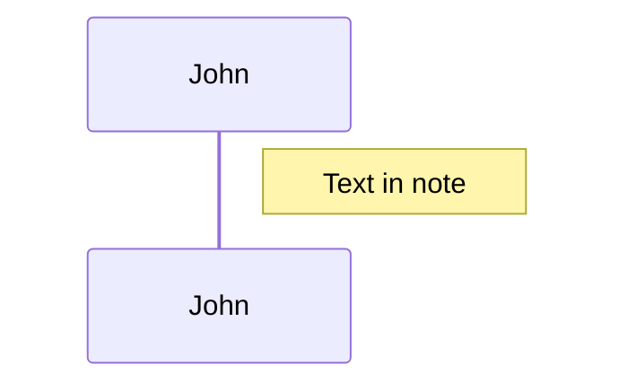

## Why React?
- Its compositional model
- Its declarative in nature
- And react really is JavaScript
- the way data flows through a component

```mermaid
sequenceDiagram
    participant John
    Note right of John: Text in note
	
```

#tags